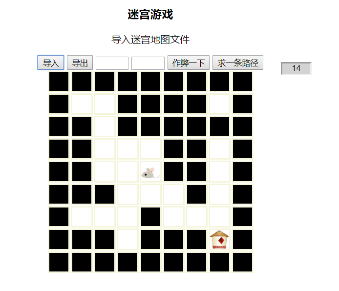

# Maze-Game
A Class Work
## 一份数据结构的作业
    基于Web的迷宫小游戏
#### 已完成功能
1. 迷宫移动
2. 胜负判定（20s）
3. 单路径寻路
4. 文件导入导出（支持迷宫自我DIY）
5. 作弊功能（墙变路，路变墙）

#### 使用说明
    可以看使用说明.txt文件
    直接打开index.html文件，示例迷宫地图（txt）放在map文件夹下，js文件夹为脚本文件以及引用的JQuery库
    操作：wasd 或者 上下左右 进行移动

